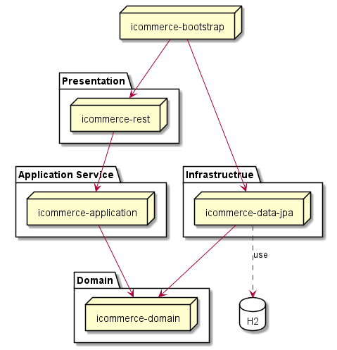
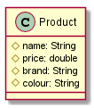

#icommerce

## Architecture

#API  Documentation
Swagger use to help user can execute the rest API with documentation
Link: <http://localhost:8080/swagger-ui.html>

# Entity table

## Library
- Lombok

# Search product

#H2
* Console link: http://localhost:8080/h2-console
* Database name:jdbc:h2:mem:testdb
* User: sa
* Pass:

#CURL
## Get product detail: 
curl -X GET "http://localhost:8080/rest/api/v1/products/2/detail" -H  "accept: */*"
##Update price
curl -X PUT "http://localhost:8080/rest/api/v1/products/update-price" -H  "accept: */*" -H  "Content-Type: application/json" -d "{\"productId\":2,\"price\":350}"
##Make order
curl -X POST "http://localhost:8080/rest/api/v1/orders/make-order" -H  "accept: */*" -H  "Content-Type: application/json" -d "{\"orderDetails\":[{\"quantity\":2,\"status\":\"NEW\",\"product\":{\"id\":1}}]}"