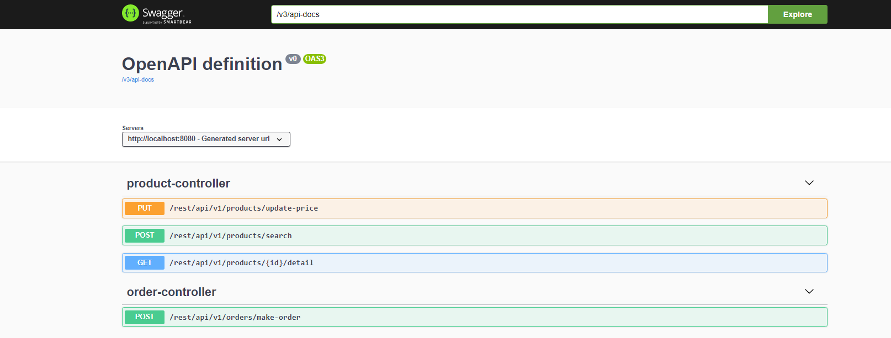

#icommerce

## Architecture

##API  Documentation
Swagger use to help user can execute the rest API with documentation
Link: <http://localhost:8080/swagger-ui.html>

## Entity table

## Library
- Lombok

## Search product
