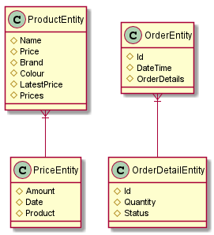

#icommerce

## Architecture


The project was design with hexagonal architecture with Domain Driven Design
* **Presentation layer**:contain the presentation of application. It maybe a rest, a console, a batch application. In this project, it's a rest service 
* **Domain layer**: It will contain all the interface for business logic. This domain we did not use any third party library
* **Database**: H2 for just demo purpose
* **Infrastructure layer**: This is layer which use for implement adapters to plug into the hexagonal architecture. It includes all the conrete implementation of jpa, rest...       
* **Bootstrap**: This is the main part. In this component, it will know all the implementations.

## Patterns
* Adapter: to build hexagonal architecture
* Builder + Visitor + Strategy to build the dynamic query: ProductSpecificationBuilder

#API  Documentation
Swagger use to help user can execute the rest API with documentation
Link: <http://localhost:8080/swagger-ui.html>


# Entity table


## Libraries
- Spring boot, Spring security
- Mockito
- Lombok, mapstruct, flyway
- Wiremock


#H2
* Console link: http://localhost:8080/h2-console
* Database name:jdbc:h2:mem:testdb
* User: sa
* Pass:

#How to run project
- Just run the BootstrapApplication
#Some operations:
* Search product:
    * **Description**: Search list of products by name or color 
    * **CURL**:
            
            curl -X POST "http://localhost:8080/rest/api/v1/products/search" -H  "accept: */*" -H  "Content-Type: application/json" -d "{\"name\":\"produ\",\"colour\":\"RED\"}"
    * **Return value**:
         ```
            [
              {
                "id": 1,
                "name": "Product 1",
                "colour": "RED",
                "price": 300
              },
              {
                "id": 4,
                "name": "Product 4",
                "colour": "RED",
                "price": 700
              },
              {
                "id": 5,
                "name": "Product 5",
                "colour": "RED",
                "price": 800
              }
            ]
            ```
* Get product detail by id
    * **Description**: Get a product with latest price
    * **CURL**:
            
            curl -X GET "http://localhost:8080/rest/api/v1/products/1/detail" -H  "accept: */*"
    * **Return value**:
         ```
            {
              "id": 1,
              "name": "Product 1",
              "colour": "RED",
              "price": 300
            }
         ```
* Update product price
    * **Description**: Update product with new price
    * **CURL**:
            
            curl -X PUT "http://localhost:8080/rest/api/v1/products/update-price" -H  "accept: */*" -H  "Content-Type: application/json" -d "{\"productId\":2,\"price\":350}"
    * **Return value**: Code 200
         
* Make an order
    * **Description**: make order with list order detail 
    * **CURL**:
            
            curl -X POST "http://localhost:8080/rest/api/v1/orders/make-order" -H  "accept: */*" -H  "Content-Type: application/json" -d "{\"orderDetails\":[{\"quantity\":2,\"status\":\"NEW\",\"product\":{\"id\":1}}]}"
    * **Return value**: Code 200